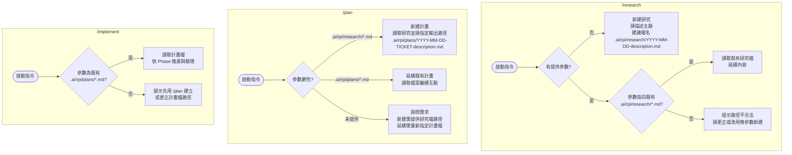

# RPI 工作流程指南

本文整理在 Codex 環境中使用 `/research`、`/plan`、`/implement` 三個 prompt 的建議流程與命名規則，協助長期維護 `.ai/rpi` 目錄下的研究、計畫與實作紀錄。專業術語維持英文，其餘採正體中文敘述。

---

## 指令概覽

- `/research <描述>`：啟動研究流程，讀取相關檔案、發起平行研究任務，最後產出 `.ai/rpi/research/YYYY-MM-DD-description.md`。
- `/plan <研究檔路徑>`：在研究成果與票證上下文的基礎上撰寫實作計畫，保存於 `.ai/rpi/plans/YYYY-MM-DD-[TICKET-]description.md`。
- `/implement <計畫檔路徑>`：依據指定計畫逐階段實作與驗證，更新計畫檔中的核取框與備註，不自動產生新檔案。

---

## 參數決策流程（Codex 0.45）



### 參數填寫要點

- Codex 0.45 支援 `$1..$9`、`$ARGUMENTS`、`$$` 等 placeholder。為避免空白被截斷，路徑包含空格時務必以雙引號包覆，例如 `/plan ".ai/rpi/research/2025-10-08 custom.md"`。
- `/research` 新增研究時不需參數；帶入參數表示「延續既有研究」，且只能指向 `.ai/rpi/research/*.md`。
- `/plan` 根據參數自動判斷是從研究檔新建計畫還是延續既有計畫，新建時計畫輸出路徑需由使用者決定。
- `/implement` 只接受計畫檔路徑；若檔案不存在，應回到 `/plan` 先建立計畫。

---

## 連續範例：有 Issue（GitLab）

情境：GitLab issue `ENG-145` 要補強 audit log。

```text
/research clarify audit log gaps ENG-145
/plan .ai/rpi/research/2025-02-15-gitlab-audit-log.md
/implement .ai/rpi/plans/2025-02-15-ENG-145-gitlab-audit-log-mvp.md
```

產出與連結：

- 研究檔案：`.ai/rpi/research/2025-02-15-gitlab-audit-log.md`  
  - Frontmatter 可加 `plan_links: [.ai/rpi/plans/2025-02-15-ENG-145-gitlab-audit-log-mvp.md]`。
- 計畫檔案：`.ai/rpi/plans/2025-02-15-ENG-145-gitlab-audit-log-mvp.md`  
  - `References` 區段列出研究檔與 GitLab issue URL (`https://gitlab.com/<group>/<repo>/-/issues/145`)。
- 實作階段：無新檔，但在 PR 或 commit 訊息標註  
  `Implements phase 1 of .ai/rpi/plans/2025-02-15-ENG-145-gitlab-audit-log-mvp.md`。

---

## 連續範例：無 Issue（內部工作）

情境：夜間排程常失敗，需要整理原因與解法。

```text
/research figure out nightly job failures
/plan .ai/rpi/research/2025-02-16-nightly-job-failures.md
/implement .ai/rpi/plans/2025-02-16-nightly-job-stabilization.md
```

產出與連結：

- 研究檔案：`.ai/rpi/research/2025-02-16-nightly-job-failures.md`
- 計畫檔案：`.ai/rpi/plans/2025-02-16-nightly-job-stabilization.md`  
  - `References` 明記「No ticket – internal initiative」。
- 實作階段：在計畫檔的核取框上標記進度，commit/PR 描述仍引用該計畫檔。

---

## 檔名規則

- 研究檔：`.ai/rpi/research/YYYY-MM-DD-description.md`  
  - `description` 使用簡短 kebab-case 文字，例如 `gitlab-audit-log`。
- 計畫檔：`.ai/rpi/plans/YYYY-MM-DD-[TICKET-]description.md`
  - 有票證時以 `ENG-145`、`ISSUE-87`、`PROJ-123` 等前綴；無票證則省略整段。
- 實作階段：直接使用計畫檔案路徑，不會自動產生新檔。

---

## 建立與維持一對多關聯

- **同一份研究 → 多個計畫**  
  - 針對同一研究檔可重複呼叫 `/plan` 產出不同計畫。例如先產出 MVP 計畫後，再次使用 `/plan .ai/rpi/research/2025-02-15-gitlab-audit-log.md` 撰寫長期方案。
  - 第二次執行時手動調整計畫檔名的描述區段，如建立  
    `.ai/rpi/plans/2025-02-20-ENG-145-gitlab-audit-log-phase-two.md`。
  - 在每份計畫的 `References` 區段都列出原始研究檔與對應 issue URL，便於追溯。

- **同一份計畫 → 多次實作批次**  
  - 依計畫不同 Phase 分段呼叫 `/implement .ai/rpi/plans/<檔名>`，視需要再執行一次同指令即可回到同一計畫。
  - 每次完成後在計畫檔的 Phase 區段寫下此次完成的 commit／PR 連結，讓後續查閱能對應到實作紀錄。

- **研究 ↔ 計畫 ↔ 實作的對照檢視**  
  - 透過檔名中的日期與描述快速排序；若有票證，保持相同票證編號。
  - Commit 或 PR 描述固定引用正在使用的計畫檔，例如  
    `Finalize Phase 2 per .ai/rpi/plans/2025-02-20-ENG-145-gitlab-audit-log-phase-two.md`。
  - 需要再次研究時可用 `/research <topic> follow-up` 更新原始研究檔，並在計畫 `References` 加註新的研究檔連結。

上述流程不用調整 Markdown 模板，即可藉由指令與檔名約定維持 1:N 關聯，讓 `.ai/rpi/research` 與 `.ai/rpi/plans` 目錄在長期使用後仍易於追蹤。
